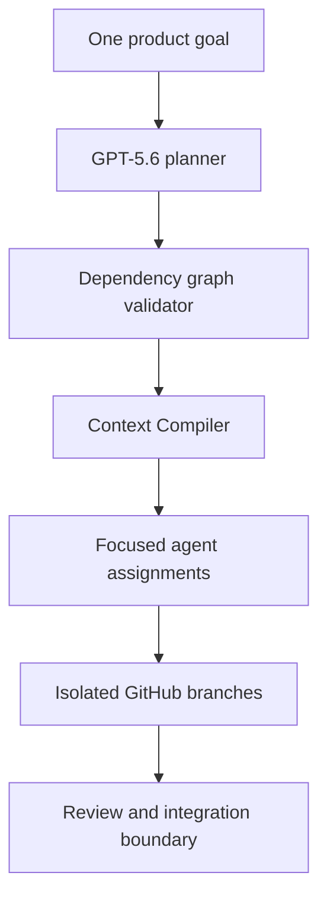

# BranchMind

**One product goal in. Validated specialist workstreams and isolated GitHub branches out.**

BranchMind is a local-first orchestration layer for collaborative, agent-assisted software development. A user describes one outcome in one interface. GPT-5.6 decomposes it into dependency-aware workstreams, the Context Compiler gives each specialist only the relevant project memory, and BranchMind provisions an isolated GitHub branch for approved work.

The result is a development system that keeps the user in one conversation while controlling context growth, token waste, branch collisions, and coordination overhead behind the scenes.

## Why BranchMind

Long-running AI development sessions accumulate unrelated history. Responses become slower and expensive context is repeatedly sent to agents that do not need it. Teams also lose time manually translating requirements into branches, ownership boundaries, and integration plans.

BranchMind treats AI work like a well-run engineering organization:

- one product-level request;
- modular specialist workstreams;
- explicit dependency contracts;
- focused context packages;
- isolated GitHub branches;
- validated, repeatable orchestration.

It is not simply Codex connected to GitHub. Its core contribution is the layer between the product goal and agent execution: validated decomposition, scoped memory compilation, deterministic workspaces, and measurable context reduction.

## Working prototype

The current prototype supports this end-to-end flow:

1. Submit a GitHub repository and product goal.
2. Invoke GPT-5.6 through the authenticated Codex CLI.
3. Generate two to six specialist workstreams.
4. Validate unique keys, dependency references, self-dependencies, and cycles.
5. Compile a focused context package for every workstream.
6. Calculate estimated full-context tokens, package tokens, avoided tokens, and savings.
7. Produce a deterministic SHA-256 fingerprint for every context package.
8. Inspect objectives, deliverables, acceptance criteria, and dependencies.
9. Create a real `agent/<workstream-key>` branch from the exact `main` SHA.
10. Recognize repeated provisioning as `existing` instead of failing or duplicating work.

Real branches created during end-to-end testing include:

- `agent/github-orchestration`
- `agent/idea-collaboration`
- `agent/workstream-planning`

## Architecture



### Main modules

| Module | Responsibility |
|---|---|
| `planning` | GPT-5.6 prompt, structured plan contract, and graph validation |
| `context` | Focused memory packages, dependency contracts, fingerprints, and savings estimates |
| `workspaces` | Safe branch naming, GitHub CLI adapter, idempotent provisioning, and UI state |
| `api/plans` | Product-goal-to-workstream endpoint |
| `api/workspaces` | Validated GitHub workspace-provisioning endpoint |

The codebase deliberately avoids a general-purpose agent framework. The orchestration rules are small, inspectable TypeScript modules built around the official Codex and GitHub CLIs.

## Context Compiler

For each workstream, the compiler includes:

- the project summary;
- that workstream's objective;
- deliverables and acceptance criteria;
- required context;
- direct dependency contracts;
- explicit excluded workstreams.

It does not blindly copy the entire plan into every agent session.

The displayed token values are reproducible estimates calculated from serialized context size using approximately four bytes per token:

```text
estimated savings =
(full context estimate - focused package estimate)
÷ full context estimate
```

These values measure relative context reduction. They are not presented as exact API billing totals.

In demonstrated plans, focused packages avoided approximately **63–74%** of estimated context per specialist.

## Security model

Workspace provisioning is designed around a narrow command boundary:

- repository and branch inputs are validated with Zod;
- workstream keys must be lowercase hyphenated values;
- duplicate and unsafe keys are rejected;
- GitHub CLI arguments are passed as an array;
- no shell is launched;
- no browser-provided GitHub token is accepted;
- authentication uses the local `gh` credential store;
- sensitive token patterns are redacted from surfaced errors;
- repeated branch requests are idempotent.

## Requirements

The prototype is a local developer tool and currently supports the tested Windows workflow.

- Node.js 22+
- npm 10+
- Git
- GitHub CLI
- Codex CLI
- an authenticated GitHub account with access to the target repository
- an authenticated ChatGPT/Codex account with GPT-5.6 access

No `OPENAI_API_KEY` is required. Planning uses the authenticated Codex CLI session.

## Installation

Clone and install:

```powershell
git clone https://github.com/Abhinav-Kakaraparthi/BranchMind.git
Set-Location BranchMind
npm install
```

Install the required CLIs if necessary:

```powershell
npm install --global @openai/codex
```

Authenticate:

```powershell
gh auth login
codex login
```

If a new PowerShell session cannot find either command, use the known Windows locations:

```powershell
& "$env:APPDATA\npm\codex.cmd" login status
& "C:\Program Files\GitHub CLI\gh.exe" auth status
```

Run BranchMind:

```powershell
npm run dev
```

Open [http://localhost:3000](http://localhost:3000).

## Judge demo

Use:

```text
Repository:
Abhinav-Kakaraparthi/BranchMind
```

```text
Product goal:
Build a collaborative developer platform where Abhi and Teju can contribute product ideas asynchronously. Convert their ideas into dependency-aware specialist workstreams, give every agent only the context required for its assignment, create an isolated GitHub branch for each workstream, compare competing implementations, combine the strongest parts, run automated tests, and return one conflict-free unified product.
```

Then:

1. Select **Generate workstreams**.
2. Inspect graph validation and estimated context savings.
3. Select different specialist workstreams.
4. Compare their dependencies, assignments, and context fingerprints.
5. Select **Create isolated branch**.
6. Observe **Branch created** or the idempotent **Branch ready** state.
7. Verify the branch on GitHub.

## Quality checks

```powershell
npm test
npm run lint
npm run build
```

The GitHub Actions quality gate runs tests, lint, and the production build for pull requests.

Test coverage currently includes:

- dependency-graph validation;
- circular, unknown, duplicate, and self-dependency rejection;
- deterministic context compilation;
- dependency-context inclusion;
- token-savings calculations;
- deterministic fingerprints;
- workspace request validation;
- safe branch naming;
- base-SHA resolution;
- branch creation and idempotency;
- provisioning failure propagation.

## Built with Codex and GPT-5.6

Codex accelerated:

- repository analysis and architecture exploration;
- Next.js implementation;
- structured GPT-5.6 planning integration;
- test generation and review;
- iterative UI development;
- debugging the local CLI boundary.

Human decisions remained central:

- rejecting a generic agent framework;
- defining the Context Compiler as the differentiator;
- choosing local authenticated CLIs instead of exposing tokens;
- rejecting an issue-tracker implementation that drifted from branch orchestration;
- separating domain, adapter, API, and UI modules;
- requiring warning-free builds and real GitHub verification.

An instructive development result reinforced the product thesis: broad repository-level agent attempts consumed roughly 50,000 tokens while drifting from a focused assignment. BranchMind's compiled specialist packages reduced estimated context by 63–74% in the demonstrated workflow.

## Prototype boundary

This submission proves planning, validated context isolation, token-efficiency measurement, and real GitHub branch provisioning.

Automated specialist code execution, competing-implementation scoring, pull-request creation, semantic merge-conflict resolution, and persistent multi-user accounts are the next orchestration stages. They are intentionally not represented as completed functionality.

## Technology

- Next.js 16
- React 19
- TypeScript
- Zod
- Vitest
- Codex CLI with GPT-5.6
- GitHub CLI
- GitHub Actions

## License

MIT
